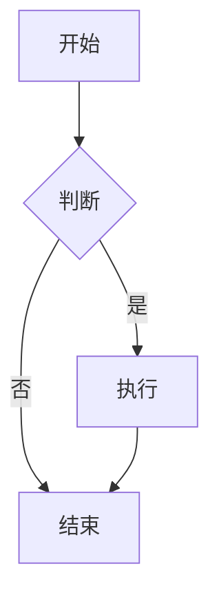
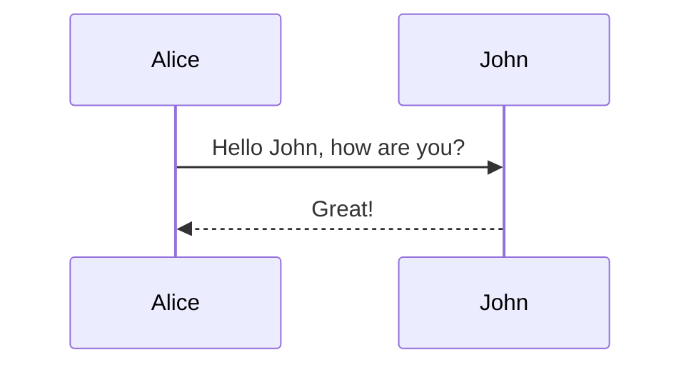

# Mermaid 图表

WeMD 内置了对 Mermaid 图表的完整支持，你可以直接在编辑器中使用文本绘制流程图、时序图、甘特图等多种图表。

## 快速插入

你可以通过以下两种方式插入图表：

1. **工具栏按钮**：点击工具栏上的 "Mermaid 图表" 按钮（类似于分支图标），选择你需要的图表类型。
2. **Markdown 语法**：手动输入 Mermaid 代码块。

::: tip
点击工具栏的 "查看更多" 可以访问更多高级图表类型，如状态图、ER 图等。
:::

## 支持的图表类型

WeMD 支持 Mermaid 的绝大多数常用图表类型。以下是一些常用示例：

### 流程图 (Flowchart)

### 时序图 (Sequence)

### 其他支持类型

- **类图 (Class Diagram)**
- **状态图 (State Diagram)**
- **实体关系图 (ER Diagram)**
- **甘特图 (Gantt)**
- **饼图 (Pie Chart)**
- **思维导图 (Mindmap)**
- **用户旅程图 (User Journey)**
- **时间线 (Timeline)**

::: tip 语法教程
不熟悉 Mermaid 语法？请参考：
- [Mermaid 官方文档](https://mermaid.js.org/intro/)
- [Mermaid 在线练习](https://mermaid.live/)
:::

## 主题适配

WeMD 的 Mermaid 渲染最大的特色是**深度的主题集成**。

Mermaid 图表会自动读取当前编辑器的主题设置（如主色调、文字颜色），确保图表风格与文案排版保持一致。

- **节点边框与线条**：跟随主题主色（Primary Color）。
- **文字颜色**：跟随主题的正文颜色。
- **背景**：自动适配透明背景，确保在深色/浅色模式下都能完美显示。

## 常见问题

### 为什么复制到公众号后变成了图片？

由于微信公众号平台的限制，文章中不支持执行 JavaScript 代码，也不支持复杂的 SVG 渲染。为了确保图表在所有设备（iOS/Android/PC）上都能以 100% 的还原度显示，WeMD 会在复制这一步将 Mermaid 图表自动转换为高分辨率图片。

### 为什么复制到微信后图表背景是白色的？

这是为了兼容微信公众号的渲染机制。但在最新的 WeMD 版本中，我们优化了连接线的渲染，使其背景透明，从而减少了对图表背景的遮挡，视觉效果更加清爽。

### 文字显示不全怎么办？

WeMD 已经针对中文字体优化了 Mermaid 的渲染逻辑（自动增加节点内边距、解除容器裁剪限制），确保中文字符不会被切断。如果你仍然遇到显示问题，尝试调整浏览器缩放或者检查是否使用了特殊的自定义字体。
