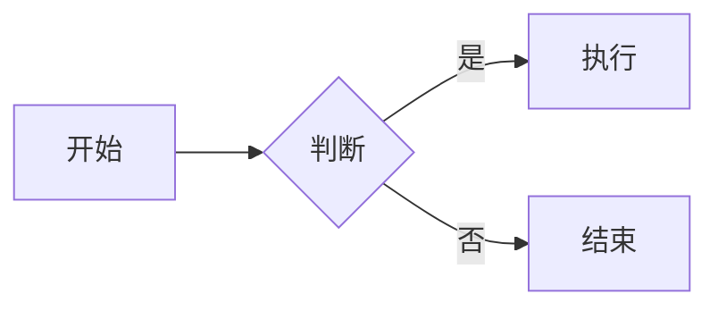

# Markdown 语法参考

本文档列出 WeMD 支持的所有 Markdown 语法，包括标准语法和扩展语法。

## 基础语法

| 语法 | 效果 | 快捷键 |
| :--- | :--- | :--- |
| `# 一级标题` | 一级标题 | `Cmd/Ctrl + 1` |
| `## 二级标题` | 二级标题 | `Cmd/Ctrl + 2` |
| `**粗体**` | **粗体** | `Cmd/Ctrl + B` |
| `*斜体*` | *斜体* | `Cmd/Ctrl + I` |
| `~~删除线~~` | ~~删除线~~ | `Cmd/Ctrl + Shift + X` |
| `` `行内代码` `` | `行内代码` | `Cmd/Ctrl + Shift + K` |
| `[链接](url)` | 链接 | `Cmd/Ctrl + K` |
| `` | 图片 | `Cmd/Ctrl + Ctrl/Alt + I` |
| `> 引用` | 引用块 | `Cmd/Ctrl + Shift + .` |
| `- 列表` | 无序列表 | `Cmd/Ctrl + Alt + L` |
| `1. 列表` | 有序列表 | `Cmd/Ctrl + Alt + O` |
| `---` | 分割线 | `Cmd/Ctrl + Alt + -` |

## 扩展语法

### 文本样式

| 语法 | 效果 | 说明 |
| :--- | :--- | :--- |
| `++下划线++` | <u>下划线</u> | 快捷键 `Cmd/Ctrl + U` |
| `==高亮==` | 高亮文本 | 荧光笔效果 |
| `H~2~O` | H₂O | 下标 |
| `X^2^` | X² | 上标 |

### 局部属性与自定义样式

可以在段落、标题或表格后添加 `{.class #id data-*=value}`，再通过自定义主题 CSS 精确设置该元素的样式。

```markdown
## 本章摘要 {.chapter-title #chapter-summary}

这是一段需要单独排版的摘要。 {.summary data-kind=abstract}

| 指标 | 数值 |
| --- | --- |
| 阅读量 | 1200 |

{.compact-table #metrics}
```

对应的自定义 CSS：

```css
#wemd .summary {
  padding: 12px 16px;
  background: #fff7e6;
}

#wemd .compact-table {
  font-size: 13px;
}
```

第一版仅支持段落、标题和表格，允许 `class`、`id` 与 `data-*`。`style`、`onclick` 等其他属性不会写入 HTML；`id="wemd"`、`data-tool` 与 `data-wemd-*` 是系统保留项。需要原样显示以 `{` 开头的属性写法时，可以写成 `\{.class}`。

### 任务列表

```markdown
- [ ] 未完成任务
- [x] 已完成任务
```

### 数学公式

```markdown
行内公式：$E = mc^2$

公式块：
$$
\sum_{i=1}^{n} x_i = x_1 + x_2 + ... + x_n
$$
```

### GitHub 提示块

```markdown
> [!NOTE]
> 背景信息或补充说明

> [!TIP]
> 有用的小技巧

> [!IMPORTANT]
> 重要提示

> [!WARNING]
> 需要注意的问题

> [!CAUTION]
> 高风险操作警告
```

### 水平滑动图组

适用于在微信公众号中展示可左右滑动的多图：

```markdown
<,,>
```

### Mermaid 图表

支持流程图、时序图、甘特图等：

````markdown

````

详见 [Mermaid 图表指南](/guides/mermaid)。

### 表情符号

支持 GitHub 风格的 Emoji 短代码：

```markdown
:smile: :heart: :thumbsup:
```

## 相关链接

- [快捷键列表](/reference/hotkeys)
- [Mermaid 图表指南](/guides/mermaid)
